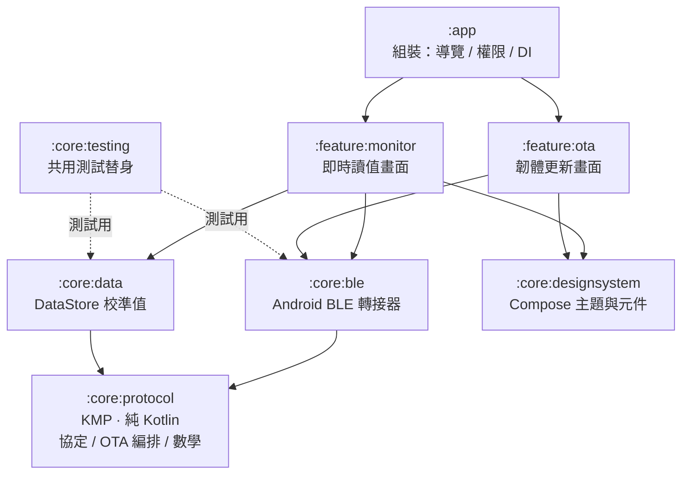
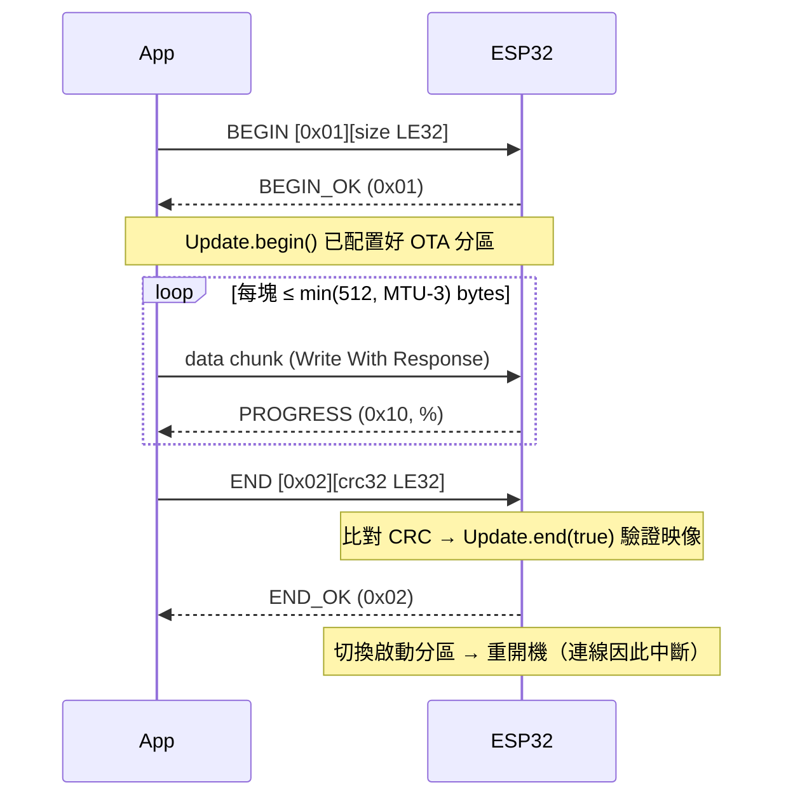

# 客戶端架構

這份文件解釋**為什麼這樣切**，不重複 README 已經有的操作步驟。

---

## 1. 模組相依圖



相依方向只能由上往下。`:core:protocol` 不依賴任何東西，
也**不准出現 `java.*` 或 `android.*`**。

---

## 2. 三層分離：為什麼這樣切

| 層 | 模組 | 能不能單元測試 | 理由 |
|---|---|---|---|
| **純邏輯** | `core:protocol` | ✅ 毫秒級、無需模擬器 | 協定解析、OTA 編排、CRC、換算——全部與平台無關 |
| **平台轉接** | `core:ble`、`core:data` | ⚠️ 只測得動純函式部分 | 幾乎每行都在跟 framework 互動，mock 測不出真相 |
| **UI** | `feature:*`、`core:designsystem` | ✅ ViewModel 可測、畫面靠 UI 測試 | 畫面無狀態，狀態全在可測的 ViewModel |

**這正是韌體端的同一套思路。** `EnvMonitor/reading_format.cpp` 與
`ota_protocol.cpp` 刻意不依賴 Arduino API，好在 PC 上用 g++ 跑測試
（見 `EnvMonitor/tests/README.md`）。客戶端只是把同樣的原則換成 Kotlin：
**把值得測的東西擠到不需要硬體的那一層**。

---

## 3. 埠與轉接器（Ports & Adapters）

整個設計的樞紐是這個介面：

```kotlin
// :core:protocol —— 純 Kotlin，沒有任何平台型別
interface GattTransport {
    suspend fun write(characteristic: BleUuid, value: ByteArray)
    fun notifications(characteristic: BleUuid): Flow<ByteArray>
    fun negotiatedMtu(): Int
}
```

`OtaUploader`（最危險的邏輯，寫錯會把設備刷成磚）只認識這個介面，
所以：

- 正式執行時接 `AndroidGattTransport`（`:core:ble`）
- 測試時接 `TestGattTransport`（一台可程式化的假設備）

於是「設備拒絕開始」「傳到一半斷線」「CRC 不符」這些**在實機上很難重現、
重現一次要好幾分鐘**的情境，全部變成毫秒級的單元測試。

UUID 也因此不能用 `java.util.UUID` —— 那是 JVM 專屬。改用自訂的
`BleUuid`（純字串 + 正規化），Android 端才在 `BleUuidExt.kt` 做一次轉換。

---

## 4. 資料流

```
韌體 (ESP32)
   │ BLE notify，約 1Hz
   ▼
AndroidGattTransport         回呼 → Flow，操作序列化
   │ Flow<ByteArray>
   ▼
AndroidEnvMonitorClient      解析 JSON、維護連線狀態
   │ StateFlow<SensorReading?> / <DeviceStatus?> / <DeviceInfo?>
   ▼
MonitorViewModel             combine + 校準值 → 一份 UI 狀態
   │ StateFlow<MonitorUiState>
   ▼
MonitorScreen                無狀態，只負責畫
```

換算（ADC → %）與文案組合都在 `ReadingTileMapper` / `StatusLineFormatter`
這兩個純函式裡，所以「小數幾位」「沒校準怎麼顯示」這種瑣碎邊界條件
不需要開模擬器就能驗證。

---

## 5. OTA 傳輸流程



### 三道安全保障

1. **Write With Response** —— 設備把上一塊寫進 flash 才回應，天然流量控制，
   不會塞爆接收緩衝
2. **CRC32 整體校驗** —— BLE 自身的 CRC 只保護單一封包；跨數千封包的
   漏塊、順序錯亂要靠這一層。不符就 `Update.abort()`，**絕不切換啟動分區**
3. **A/B 雙分區** —— 新韌體寫到另一個分區，驗證全部通過才切換啟動指標。
   任何失敗（含中途拔電、關 App）設備都繼續跑舊韌體

### 為什麼分塊大小要跟著 MTU 走

手機協商到的 MTU 不一定是設備要求的 517，常見 23 / 185 / 247。
硬寫 512 的話，協定層會**默默截斷**封包 —— 設備收到殘缺位元組照樣寫進
flash，要到最後 END 驗證才失敗，白傳好幾分鐘。這是網頁版現存的隱患
（Web Bluetooth 不提供 MTU 查詢），原生版用
`GattContract.chunkSizeForMtu(mtu)` 解掉。

---

## 6. 測試策略

### 用手寫 fake，不用 mock 框架

OTA 是**有狀態的來回對話**：「收到 BEGIN 才回 BEGIN_OK」「灌到第 3 塊時
設備回報錯誤」。用 MockK 的 stub 設定表達這種因果關係又臭又長，而且
mock 設定寫錯時測試依然綠燈 —— 測到的是自己的假設，不是程式碼。

`TestGattTransport` 是一台真的能跑的假設備，行為看得見、除錯容易：

```kotlin
val transport = TestGattTransport(mtu = 23)
transport.errorAfterDataWrites = 3        // 灌到第 3 塊時設備報錯
val events = OtaUploader(transport).upload(firmware).toList()
```

### 虛擬時間

逾時測試設的是 10 秒 / 20 秒，但在 `runTest` 的虛擬時間下瞬間完成，
不會讓測試真的等 30 秒。

### 刻意不測的部分

`AndroidGattTransport`、`AndroidEnvMonitorClient`、`DataStoreCalibrationRepository`
——它們幾乎每行都在跟 framework 互動。與其寫一堆「我以為 framework 這樣運作」
的 mock 測試製造虛假的安全感，不如把該測的邏輯抽走（已經抽走了），
剩下的靠 UI 測試與實機驗證。

---

## 7. 加一個平台要做什麼

以 iOS 為例：

1. `core/protocol/build.gradle.kts` 的 iOS target **已經宣告好了**，
   協定層直接可用（解析、OTA 編排、CRC、換算、100+ 個測試全部沿用）
2. 寫一個 `IosGattTransport : GattTransport`，用 CoreBluetooth 實作三個方法
3. 寫一個 `IosEnvMonitorClient : EnvMonitorClient`（掃描、連線、訂閱）
4. UI 用 Compose Multiplatform 共用，或用 SwiftUI 另寫

**要寫的只有第 2、3 點，約 200 行平台程式碼。** 這就是把 `GattTransport`
做成介面的回報。

| 平台 | 狀態 | BLE 障礙 |
|---|---|---|
| Android | ✅ 已完成 | — |
| iOS | 協定層已就緒 | 需寫 CoreBluetooth 轉接器 |
| Web | 已有網頁版 | Web Bluetooth（Chrome/Edge；iOS Safari 不支援） |
| Windows / macOS / Linux 桌面 | 未做 | 各平台 BLE API 差異大，沒有成熟的 KMP 函式庫 |

---

## 8. 新增一個 feature 模組的檢查清單

1. `settings.gradle.kts` 加 `include(":feature:xxx")`
2. 複製 `feature/monitor/build.gradle.kts` 改 namespace
3. `:app` 的 `build.gradle.kts` 加 `implementation(project(":feature:xxx"))`
4. 建立 `src/main/AndroidManifest.xml`（空的 `<manifest/>` 即可）
5. 寫 `XxxUiState`（純資料）→ `XxxViewModel`（`@HiltViewModel`）→
   `XxxScreen`（`internal`、無狀態）→ `XxxRoute`（接 `hiltViewModel()`）
6. 任何換算 / 文案組合抽成 object 純函式，**先寫測試再寫實作**
7. `EnvMonitorNavHost.kt` 加目的地
8. UI 元件掛 `testTag`，UI 測試靠它定位而不是靠顯示文字

---

## 9. 契約在哪裡

GATT 的 UUID、JSON 欄位、OTA 封包格式的**單一事實來源是
[`../EnvMonitor/BLE.md`](../EnvMonitor/BLE.md)**。

三邊必須同步：

- 韌體 `EnvMonitor/ble.cpp`、`ble_ota.cpp`、`ota_protocol.cpp`
- 原生 App `core/protocol/src/commonMain/.../GattContract.kt`
- 網頁版 `cloud/src/ble-app.html`

`GattContractTest` 把 UUID 字面值再抄一次做比對 —— 看似重複，
但改錯 UUID 的症狀是「連得上卻找不到 service」且 BLE 完全不報錯，
極難除錯，值得用測試釘死。
